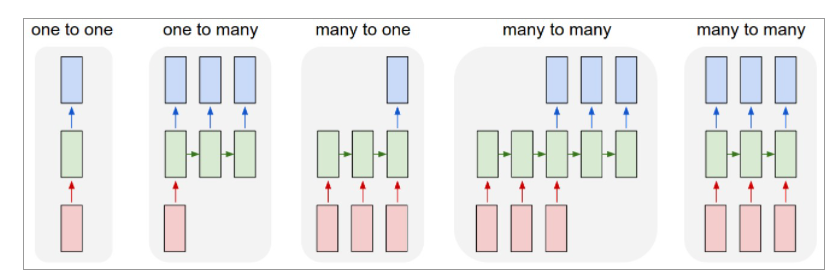
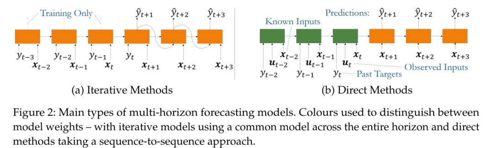

<!-- @import "[TOC]" {cmd="toc" depthFrom=1 depthTo=6 orderedList=false} -->

<!-- code_chunk_output -->

- [What you need know before starting the project](#what-you-need-know-before-starting-the-project)
  - [TimeSeries Basic](#timeseries-basic)
    - [TimeSeries concept](#timeseries-concept)
    - [TimeSeries components](#timeseries-components)
    - [TimeSeries properties](#timeseries-properties)
  - [TimeSeries Forecasting](#timeseries-forecasting)
    - [TimeSeries Forecasting Tasks](#timeseries-forecasting-tasks)
      - [Single-horizon forecasting](#single-horizon-forecasting)
      - [Multi-horizon forecasting](#multi-horizon-forecasting)
    - [TimeSeries forecasting models](#timeseries-forecasting-models)
      - [Basic Building Blocks](#basic-building-blocks)
  - [References](#references)

<!-- /code_chunk_output -->

# What you need know before starting the project
## TimeSeries Basic
### TimeSeries concept
a time series is a series of data points indexed (or listed or graphed) in time order. Most commonly, a time series is a sequence taken at successive equally spaced points in time. Thus it is a sequence of discrete-time data. 

### TimeSeries components
These are the components of a time series
* Trend - Consistent upwards or downwards slope of a time series
* Seasonality - Clear periodic pattern of a time series(like sine funtion)
* Noise - Outliers or missing values
### TimeSeries properties
A stationary time series is one whose statistical properties such as mean, variance, autocorrelation, etc. are all constant over time.
* Strong stationarity:  is a stochastic process whose unconditional joint probability distribution does not change when shifted in time. Consequently, parameters such as mean and variance also do not change over time.
* Weak stationarity: is a process where mean, variance, autocorrelation are constant throughout the time

Stationarity is important as  non-stationary series that depend on time have too many parameters to account for when modelling the time series. diff() method can easily convert a non-stationary series to a stationary series.

We will try to decompose seasonal component of the above decomposed time series.

## TimeSeries Forecasting
Time series forecasting (TSF) plays a key role in a wide range of real-life problems that have a temporal component. Predicting the future through TSF is an essential research topic in many fields such as the weather, energy consumption, financial indices, retail sales, medical monitoring, anomaly detec-tion, traffic forecasting,etc. The unique characteristics of time series data, in which observations have a chronological order, often make their analysis a challenging task. Given its complexity, TSF is an area of paramount importance in data mining. TSF models need to take into account several issues such as trend and seasonal variations of the series and the correlation between observed values that are close in time. Therefore, over the last decades,researchers have placed their efforts on developing specialized models that can capture the underlying patterns of time series, so that they can be extrapolated to the future effectively.
Deep learning in particular has gained popularity in recent times, inspired by notable achievements in image classification, natural language processing and reinforement learning. By incorporating bespoke architectural assumptions – or inductive biases – that reflect the nuances of underlying datasets,deep neural networks are able to learn complex data representations, which alleviates the need for manual feature engineering and model design.
### TimeSeries Forecasting Tasks
TimeSeries forecasing tasks can be roughly classified from three perspectives in the table1.

|n.inputs|horizon|point or prob|
|---|---|---|---|
|univariate|one-horizon|point|
|multivariate|multi-horizon|probabilistic|

&ensp;According to the number of input variables, it can be divided into univariate, multivariate time series forecasting. The difference is whether the input variables contain covariates. For example, when predicting future PM2.5 concentration, if only time information and historical PM2.5 are available, it is a univariate forecasting task. If the concentration of other pollutants such as PM10, O3 are available (i.e. covariates, the historical PM2.5 is included usually), it is called a multivariate forecasting task. Note that we don't just predict a single target variable, sometimes need predict PM2.5, PM10, and O3 at the same time. A single-output task can be easily transformed to a multi-output task by revised `out_size` in a network. 
&ensp;According to the forecasting step size, it can be divided into one-horizon/step and multi-horizon/step forecasting. The former only predicts the target varible at one moment in the future, and the latter predicts the target varible at several moments in the future, which provides the decision maker the trend information of the target. 
&ensp;**Borrowing concepts from the NLP domain, we mainly focus on the many-to-one (the third subplot that means single-horizon forecasting) and many-to-many task(the forth subplot that means multi-horizon forecasting) in this project (the many-to-many task showed in the last subplot is also viewed as multi-horizon forecasting in some articles and [challenge matches](https://github.com/maxjcohen/ozechallenge_benchmark)).**

  
<b>Figure 1.</b> Multivariate forecasting results.

&ensp; Each rectangle is a vector and arrows represent functions (e.g. matrix multiply). Input vectors are in red, output vectors are in blue and green vectors hold the RNN's state (more on this soon). From left to right: (1) Vanilla mode of processing without RNN, from fixed-sized input to fixed-sized output (e.g. image classification). (2) Sequence output (e.g. image captioning takes an image and outputs a sentence of words). (3) Sequence input (e.g. sentiment analysis where a given sentence is classified as expressing positive or negative sentiment). (4) Sequence input and sequence output (e.g. Machine Translation: an RNN reads a sentence in English and then outputs a sentence in French). (5) Synced sequence input and output (e.g. video classification where we wish to label each frame of the video). Notice that in every case are no pre-specified constraints on the lengths sequences because the recurrent transformation (green) is fixed and can be applied as many times as we like. [source](http://karpathy.github.io/2015/05/21/rnn-effectiveness/)
&ensp; At last, regardless of the form of the target, forecastings can be further divided into two different categories – point estimates and probabilistic forecasts. Many models only provide point forecasting but not probabilistic forecasting. Thus, we mainly focus on the former in the project.

#### Single-horizon forecasting
&ensp;Since multivariate output can be easily obtained (as mentioned earlier), the following mainly focuses on univariate output.
$$\hat{y}_{i, t+1}=f\left(y_{i, t-k: t}, \boldsymbol{x}_{i, t-k: t}, \boldsymbol{u}_{t-k: t+1}, \boldsymbol{s}_{i}\right)$$

$\mu$ are known future inputs (e.g. date information), $y_{i, t-k: t}=\left\{y_{i, t-k}, \ldots, y_{i, t}\right\}$ are observations of the target, $\boldsymbol{x}_{i, t-k: t}=\left\{\boldsymbol{x}_{i, t-k}, \ldots, \boldsymbol{x}_{i, t}\right\}$ are exogenous inputs(covirates) that can only be observed historically over a look-back window $k,s_i$ is static metadata associated with the entity (e.g. age, sensor location, air monitoring station, stockid), and $f(.)$ is the forecasting function learnt by the model. While we focus on univariate forecasting in this survey (i.e. 1-D targets), we note that the same components can be extended to multivariate models without loss of generality. 
&ensp;For notational simplicity , we omit the entity index $i$ in subsequent sections unless explicitly required. `In fact, when the dataset contains multiple entities, especially when the entities contain multiple variables, although the task can be viewed as time series prediction, we prefer to call it spatiotemporal prediction which is beyond the scope of this project.`

#### Multi-horizon forecasting
$$\hat{y}_{t+1:t+\tau}=f\left(y_{t-k: t}, \boldsymbol{x}_{t-k: t}, \boldsymbol{u}_{t-k: t+\tau}, \boldsymbol{s} \right)$$

Deep learning architectures for multi-horizon  forecasting can be divided into iterative and direct methods – as shown in Figure 2 and described in [the survey](https://arxiv.org/abs/2004.13408) in detail.
&ensp;It should be noted that the seq2seq structure does not necessarily have to be used when predicting multiple horizon with a direct method. Models containing only a encoder structure can also achieve multi-horizon forecasting, although the forecasting results may be rough.

  
<b>Figure 2.</b> Multivariate forecasting results.

### TimeSeries forecasting models
&ensp;In a broad sense, the deep neural networks used in time series prediction are all sequence-to-sequence (seq2seq) structures, that is, the encoder is used to encode historical information into latent states$\boldsymbol{z_t}$, and then the decoder is used to convert $\boldsymbol{z_t}$ and other information into outputs, namely:

$$\begin{gather}
\boldsymbol{z}_{t}=g_{\mathrm{enc}}\left(y_{t-k: t}, \boldsymbol{x}_{t-k: t}, \boldsymbol{s}\right)\\
y_{t+1:t+\tau}=g_{\operatorname{dec}}\left(\boldsymbol{z}_{t}, y_{t-k: t}, \boldsymbol{x}_{t-k: t}, \boldsymbol{s}\right)
\end{gather}$$
where $g_{enc}(.)$, $g_{enc}(.)$ is encoder and decoder respectively.
&ensp;In a narrow sense, the model whose output is obtained only through the latent states $\boldsymbol{z_t}$ does not have a decoder module (generally transformed through a simple nonlinear layer), and the model at this time no longer has a seq2seq structure.

#### Basic Building Blocks

CNN, RNN（Basic RNN, LSTM, GRU), Attention, hybrid

## References
[1]. https://arxiv.org/abs/2004.13408
[2]. http://karpathy.github.io/2015/05/21/rnn-effectiveness/
[3]. https://github.com/maxjcohen/ozechallenge_benchmark
